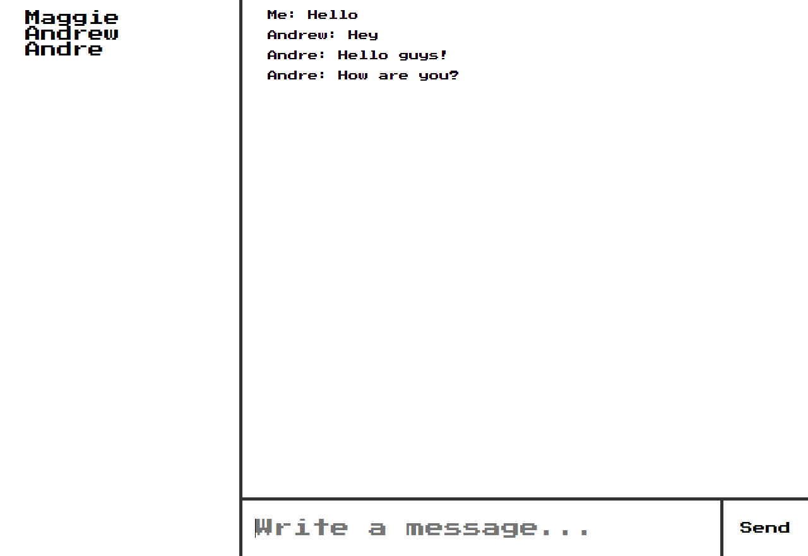

# Chat App
> Chat with real-time menssages

Made with React, Redux and Redux-Sagas in the frontend. In the backend I used WebSockets(WS NodeJS).

I also used `chance`, a library used to generate random things, in this case, names.

## Installing / Getting started

First, we clone and install the dependencies. Then we initiate the server.

```shell
git clone https://github.com/ArmandoGraterol/chat
cd chat
npm install
cd server
node index
```
Lastly, we open a new cmd and navigate back to `chat` to initialize the client.

```shell
cd chat
npm start
```

The Websocket server starts on port 8080. You can change it on server/index.js.

## Features

* Instant messages between users connected.
* List displaying all the users currently online.
* Messages are not saved once the user disconnect nor they can see messages sent while they were offline.

## Licensing

The code in this project is licensed under MIT license.